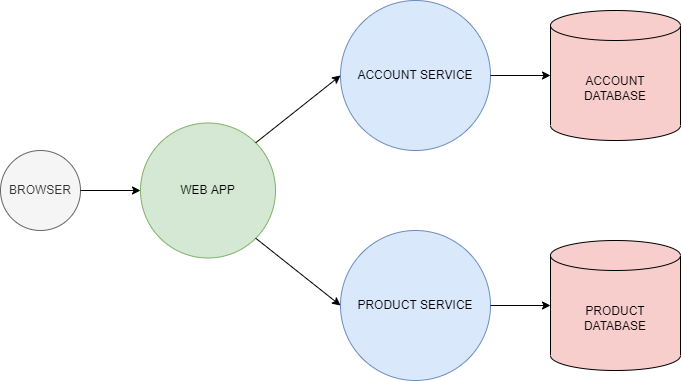
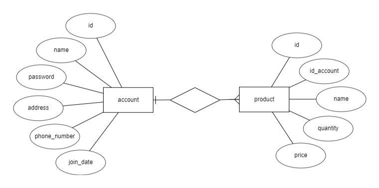

# **MICROSERVICE ARCHITECTURE**



# **ENTITY RELATIONSHIP DIAGRAM**

 

# **LIST API**

#User

- account 
```
{
    id : int
    name : string
    password : string
    address : string
    phone_number : int
    join_date : datetime
}
```
**GET /users**
----
  Returns all users in the system.
* **URL Params**  
  None
* **Data Params**  
  None
* **Headers**  
  Content-Type: application/json  
* **Success Response:**  
* **Code:** 200  
  **Content:**  
```
{
  users: [
           {<user_object>},
           {<user_object>},
           {<user_object>},
           {<user_object>},
           {<user_object>},
           {<user_object>}
         ]
}
```

**POST /users**
----
  Creates a new User and returns the new object.
* **URL Params**  
  None
* **Headers**  
  Content-Type: application/json  
* **Data Params**  
```
  {
    username: string,
    password: string,
    address: string,
    phone_number: string
  }
```
* **Success Response:**  
* **Code:** 200  
  **Content:**  `{ <user_object> }` 

**DELETE /users/**
----
  Deletes the specified user.
* **URL Params**  
  None
* **Data Params**  
  {
    username: string
  }
* **Headers**  
  Content-Type: application/json  
* **Success Response:** 
  * **Code:** 200
* **Error Response:**  
  * **Code:** 404  
  **Content:** `{error : "Invalid user name (No User Found!)" }`  

#Products

* Product object

```
{
    id : int
    id_account : int
    name : string
    quantity : int
    price : int
}
```

**GET /products**
----
  Returns all products in the system.
* **URL Params**  
  None
* **Data Params**  
  None
* **Headers**  
  Content-Type: application/json  
* **Success Response:** 
* **Code:** 200  
  **Content:**  
```
{
  products: [
           {<product_object>},
           {<product_object>},
           {<product_object>},
           {<product_object>},
           {<product_object>}
         ]
}
``` 
**POST /products/:id_account/**
----
  Creates a new Product and returns the new object.
* **URL Params**  
  *Required:* `id_account=[int]`
* **Data Params**  
```
  {
    name: string
    quantity: int
    price: int
  }
```
* **Headers**  
  Content-Type: application/json  
* **Success Response:**  
* **Code:** 200  
  **Content:**  `{ <product_object> }` 

**PUT /products/:id_account/:id**
----
  Updates fields on the specified product and returns the updated object.
* **URL Params**  
  *Required:* `id_account=[int]`, `id=[integer]`
* **Data Params**  
```
  {
  	name: string
    quantity: int
    price: int
  }
```
* **Headers**  
  Content-Type: application/json  
* **Success Response:** 
* **Code:** 200  
  **Content:**  `{ <product_object> }`  
* **Error Response:**  
  * **Code:** 404  
  **Content:** `{ error : "Invalid ID" }`  

**DELETE /products/**
----
  Deletes the specified product.
* **URL Params**  
  None
* **Data Params**  
  {
     name: string
  }
* **Headers**  
  Content-Type: application/json  
* **Success Response:**  
  * **Code:** 200
* **Error Response:**  
  * **Code:** 404  
  **Content:** `{ error : "Invalid product name (No User Found!)" }`  

